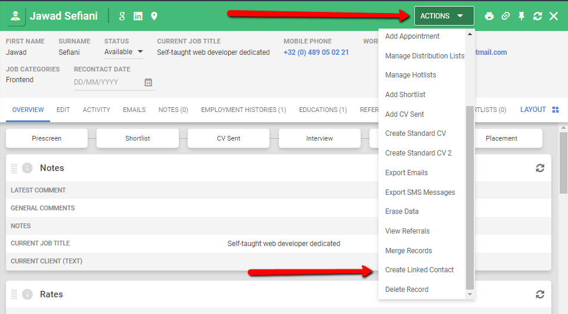

Candidate And Contact Duplication
=================================

Candidate: Iemand die we kunnen plaatsen of in dienst nemen  
Contact: Alle andere personen  

Om een Candidate te dupliceren als een Contact (of omgekeerd).
Ga via de ACTIONS button en kies "Create Linked Record".

Als een van de records per ongeluk aangemaakt is, dan kan deze
verwijderd worden via "EDIT" en dan "DELETE" in plaats van "SAVE".

Het is ook mogelijk om de 2 records te mergen via de ACTIONS button
en dan "Merge Records".
