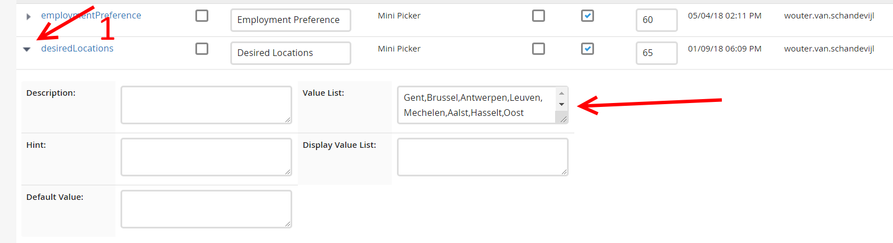

Candidate Desired Locations
===========================

Menu > Admin > Field Mapping

Candidate openklikken en dan zoeken naar "desiredLocations".
(gebruik Control + F)

Openklikken zoals op de foto, de lijst aanpassen `,` (komma) tussen de verschillende waarden.
En niet vergeten te saven met de knop bovenaan.

Other possibilities
-------------------

De lijst die we dan wel zouden nemen

- West-Vlaanderen
- Oost-Vlaanderen
- Antwerpen(provincie)
- Vlaams-Brabant
- Limburg
- Brussel
- Antwerpen
- Gent
- Leuven
- Mechelen
- Hasselt

De hele lijst(dachten we dus niet er in te zetten):

- Aalst
- Aarschot
- Bornem
- Brugge
- Dendermonde
- Eeklo
- Geel
- Halle
- Hasselt
- Hasselt
- Heist-op-den-berg
- Kortrijk
- Leuven
- Luik
- Mechelen
- Ninove
- Oudenaarde
- Peer
- Roeselare
- Sint-niklaas
- Sint-truiden
- Tienen
- Tongeren
- Turnhout
- Waver
- Zaventem
- Geraardsbergen
- Waregem
- Zelzate
