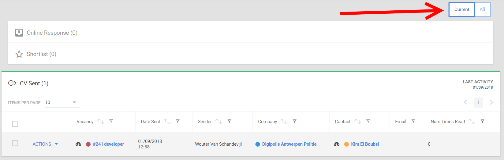
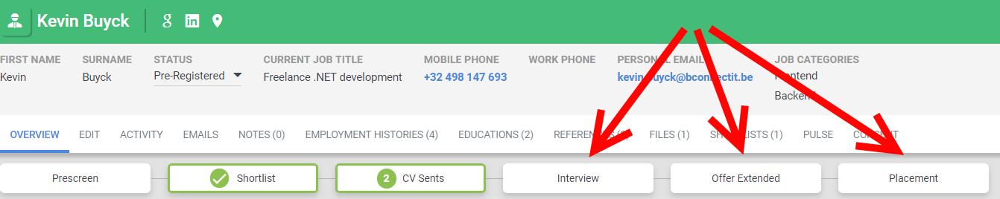
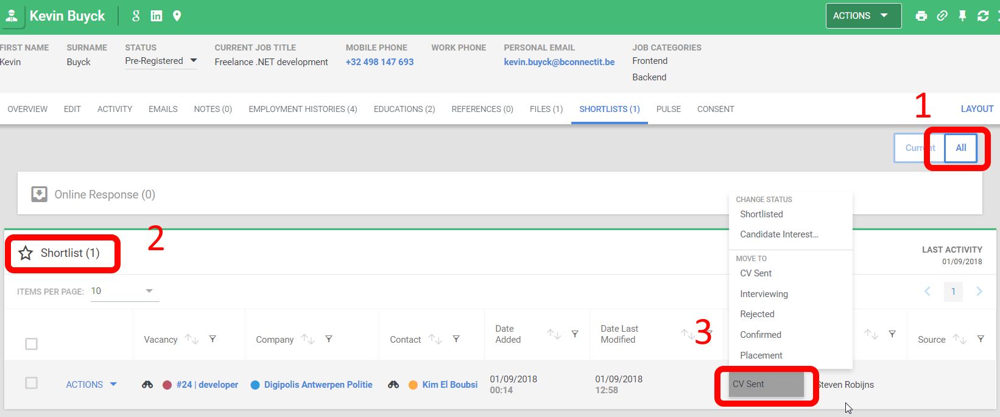

Shortlist Flow
==============

Op het shortlist scherm kan je "Current" en "All" doen

**Current** > Dan zie je enkel de kandidaten in hun huidige stap in het proces
**All** > Dan zie je de kandidaten terugkomen in alle stappen die ze reeds doorlopen hebben

Het aanpassen van de status van een kandidaat in de shortlist kan op verschillende manieren:

Je kan op bovenstaand scherm op "All" duwen en dan is er een dropdown met 
de verchillende mogelijkheden in de shortlist panel:

Een andere mogelijkheid is om op de details van een kandidaat op de "Overview" tab rechtstreeks
op een van de andere stappen te klikken (je kan hierbij ook stappen overslaan:
je kan dus vb van CV Sent direct naar Placement gaan)

